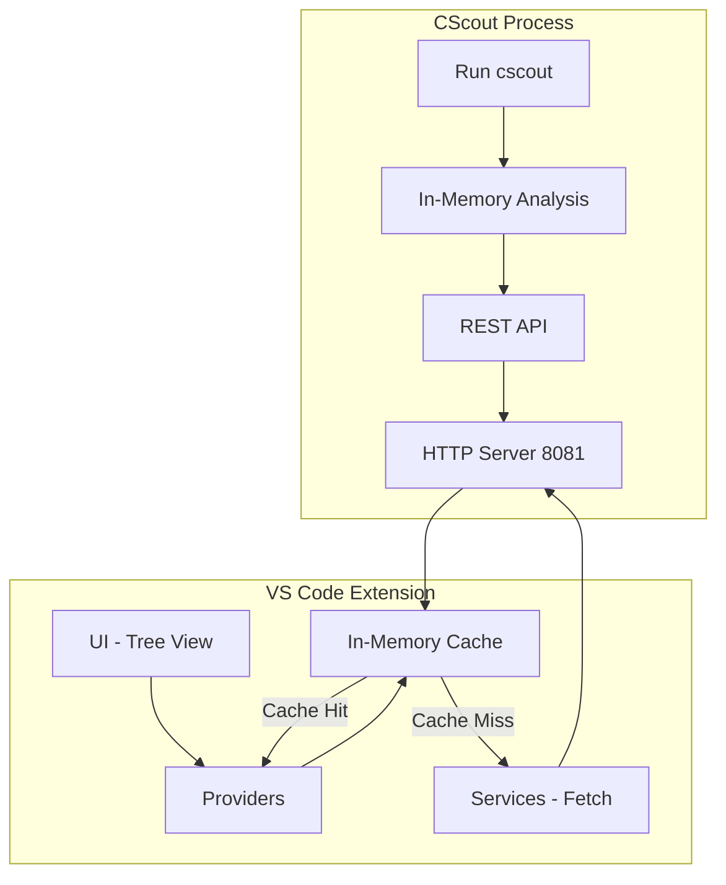
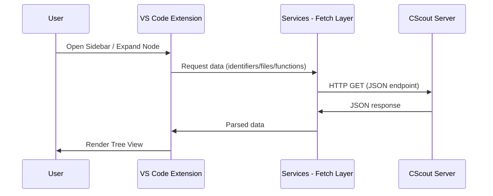

# Prototype Overview

This prototype implements a VS Code extension that integrates with the CScout semantic analysis engine to provide structured program understanding inside the editor.

The system is designed to **consume structured data (JSON)** directly from CScout rather than relying on HTML scraping as the primary mechanism. This ensures better reliability, performance, and extensibility.

---

## What This Prototype Does

The extension provides a **semantic navigation and analysis layer** for C projects inside VS Code.

It enables:

- Exploration of identifiers and their relationships
- File-level insights and metrics
- Function-level navigation and call relationships
- Dependency visualization between components
- Interactive filtering and exploration of large datasets

---

# Architecture — Actual Data Flow

The system operates by leveraging CScout's in-memory semantic analysis and exposing it via HTTP endpoints, which are then consumed directly by the VS Code extension.

---

## System Architecture


The system operates by leveraging CScout’s in-memory semantic analysis and exposing it via HTTP endpoints, which are then consumed directly by the VS Code extension.


---


## Execution Flow



---

## How It Actually Works

**1. CScout is executed on a project**
- Parses the entire C codebase
- Builds a complete semantic model in memory

**2. CScout exposes this data**
- Through HTTP endpoints on `:8081`
- Data is generated dynamically from in-memory analysis

**3. VS Code Extension connects**
- Uses `fetch` to call endpoints
- No intermediate processing layer

**4. Services Layer**
- Sends HTTP requests
- Applies filters via query params
- Returns structured JSON

**5. Providers Layer**
- Converts JSON into VS Code `TreeItem`s

**6. UI Layer**
- Displays hierarchical data
- Handles user interactions (expand, click, actions)

---

# CScout VS Code Extension - Setup Guide

## Installation
```bash
npm install
npm run build
```

## Running the Extension

### 1. Launch Extension Development Host
- Open project in VS Code
- Press **F5**

### 2. Start CScout Server
```bash
cscout your-project.cs
```
Server runs at `http://localhost:8081`

### 3. Connect Extension
- Open Command Palette (**Ctrl+Shift+P**)
- Run: `CScout: Connect to Running Server`

---

## Quick Start
```bash
# Terminal 1
cscout your-project.cs

# Terminal 2 (VS Code)
npm install && npm run build
# Press F5, then Ctrl+Shift+P → "CScout: Connect to Running Server"
```
## Core Features

### 1. Identifiers

Provides structured exploration of all identifiers in the project.

**Capabilities:**
- Lists identifiers grouped by type:
  - Functions  
  - Variables  
  - Macros  
  - Structs  
  - Typedefs  
- Displays contextual metadata directly in the tree
- Supports navigation and structured inspection

**Filtering (Integrated):**
- Multi-select filter system via UI
- Supported filters:
  - Read-only  
  - Writable  
  - Unused  
  - Macro  
  - Function / Variable / Struct / Typedef  
- Filters are applied at query level (via API params),   


 

---

### 2. Files

Provides a hierarchical view of all files in the project with structured exploration and filtering.

**Capabilities:**
- Lists all files with basic metadata (e.g., line count)
- Expandable structure per file:
  - Metrics (basic)
  - Functions
  - Includes
  - Dependencies
- Enables quick navigation across project files

**Includes:**
- Displays included headers/files
- Shows inline attributes (e.g., direct, writable, unused)

**Filtering:**
- Supports file-level filtering via UI
- Example filters:
  - All Files  
  - Read-only Files  
  - Writable Files  
  - *(+ additional filters such as files with strings, unprocessed lines, etc.)*  
- Filters are applied at query level for efficient data loading

**Dependencies (Focused Mode):**
- Expanding **Dependencies** switches to a focused view
- Shows relationships in structured groups:
  - Compile  
  - Call  
  - Data  
- Enables deeper analysis of file-level interactions without clutter


---

### 3. Functions & Macros

Provides function-level exploration with call relationships and interactive visualization.

**Capabilities:**
- Lists all functions and macros in the project
- Each function expands into:
  - **Callees** → functions it invokes  
  - **Callers** → functions invoking it  
- Supports lazy loading (one level at a time)
- Uses in-memory caching for repeated expansions

**Graph Visualization:**
- Each function provides a graph view (👁 Eye icon)
- Opens inside VS Code (WebView)
- Displays **combined call graph**:
  - Callers + Callees in a single view  
- Supports:
  - Zooming and navigation  
 

---
### 4. Dependencies

Provides structured exploration of file-level relationships across compile-time, call flow, and data flow.

---

**Structure:**

```
File
 ├── Compile
 │    ├── Uses →  (Outgoing / Incoming / Bidirectional)
 │    └── Used By ←
 ├── Calls
 │    ├── Uses →
 │    └── Used By ←
 └── Data
      ├── Uses →
      └── Used By ←
```

---

**Capabilities:**

- **Compile** → include relationships
- **Calls** → function call relationships
- **Data** → global variable access
- Organized into **Uses (→)** and **Used By (←)** directions
- Enables clear navigation across dependency types and directions

---

**Interactive Actions:**

| Action | Description |
|--------|-------------|
| 👁 Eye | Opens graph visualization |
| 🌐 Globe | Toggles filter (e.g., show all) |
| ✏️ Pencil | Indicates writable|
---


## API Usage

The extension directly consumes CScout REST endpoints exposed via the built-in HTTP server.

### Available Endpoints

| Endpoint | Purpose |
|----------|---------|
| `/api/identifiers` | Fetch list of identifiers (with filtering support) |
| `/api/identifier` | Fetch detailed information for a specific identifier |
| `/api/identifier/locations` | Retrieve all locations/usages of an identifier |
| `/api/files` | Fetch list of project files |
| `/api/file/includes` | Get include relationships for a file |
| `/api/file/dependencies` | Fetch compile, call, and data dependencies for a file |
| `/api/functions` | Fetch list of functions |
| `/api/funlist` | Retrieve function call relationships (callers / callees) |

---

### Notes
- All endpoints are accessed via HTTP (`http://localhost:8081`)
- Query parameters are used for:
  - Filtering (e.g., readonly, writable, unused)
  - Scope control (file, function, identifier level)
  - Directional queries (callers vs callees)
- The extension reuses CScout’s existing query parameter patterns (as used in the HTML interface) instead of introducing custom API parameters
- The extension fetches data **on demand** and caches results in memory for performance
---
## Project Structure

```
cscout-vscode/
├── src/
│   ├── providers/                     # VS Code TreeDataProviders (UI logic for sidebar views)
│   │   ├── identifierProvider.ts      # Handles identifier tree + filtering
│   │   ├── fileProvider.ts            # Manages file tree + file-level sections
│   │   ├── funcSectionProvider.ts     # Handles functions (callers/callees + caching)
│   │   └── dependencyProvider.ts      # Manages dependency tree + relationships
|   |   └── CScoutViewProvider.ts      # Handles identifier tree + filtering
│   │
│   ├── services/                      # API layer (fetching data from CScout)
│   │   ├── cscoutApi.ts               # Base request handler (HTTP calls)
│   │   ├── fileApi.ts                 # File-related API calls
│   │   ├── functionApi.ts             # Function + call graph API calls
│   │   └── dependencyApi.ts           # Dependency-related API calls
│   │   
│   │
│   └── extension.ts                   # Entry point (activates extension, registers commands)
│
├── resources/                         # Static assets (icons, UI resources)
├── out/                               # Compiled JS output (build artifacts)
└── package.json                       # Extension config (commands, views, metadata)
```


## What This Prototype Demonstrates

- Feasibility of integrating CScout into VS Code
- Direct JSON-based interaction model
- Structured exploration of semantic program data
- Scalable UI for large C codebases

---

## Future Work

- RenameProvider (workspace-wide refactoring)
- CodeLens integration (call counts, metrics)
- Interactive WebView-based graphs
- Enhanced function-level metrics API
- Custom query support (identifiers, files, functions)